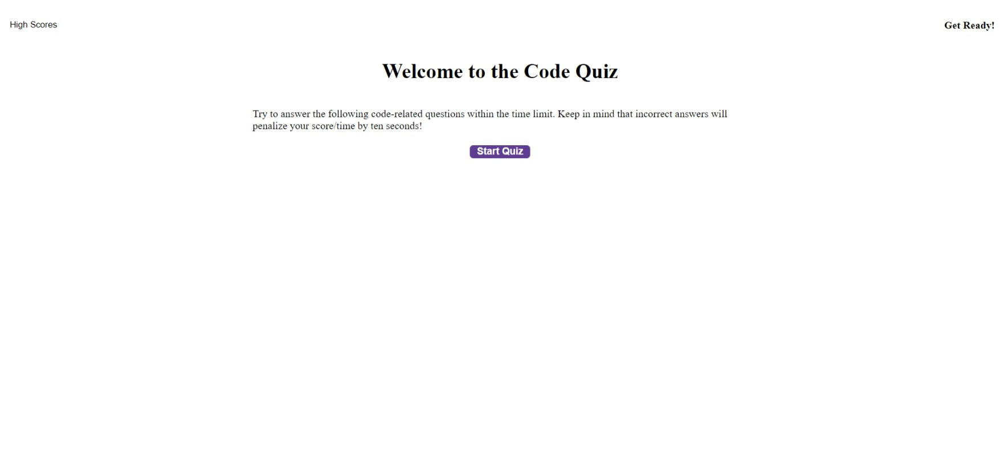

# Coding Interview Quiz

## Description

This is a quick multiple choice quiz designed to prepare you for coding interviews. It randomly selects questions from an array of objects and displays them in the browser. The user can then select an answer and the program will tell them if they are correct or not. The program will also keep track of the number of correct answers and allow the user to save their score and initials to local storage.

## Usage

[Link to page](https://lesley-byte.github.io/codingInterviewQuiz/)

## Screenshot

## Credits

Thank you to family and friends for their support.

## License

MIT License

## Badges

Copyright (c) 2022 lesley-byte
